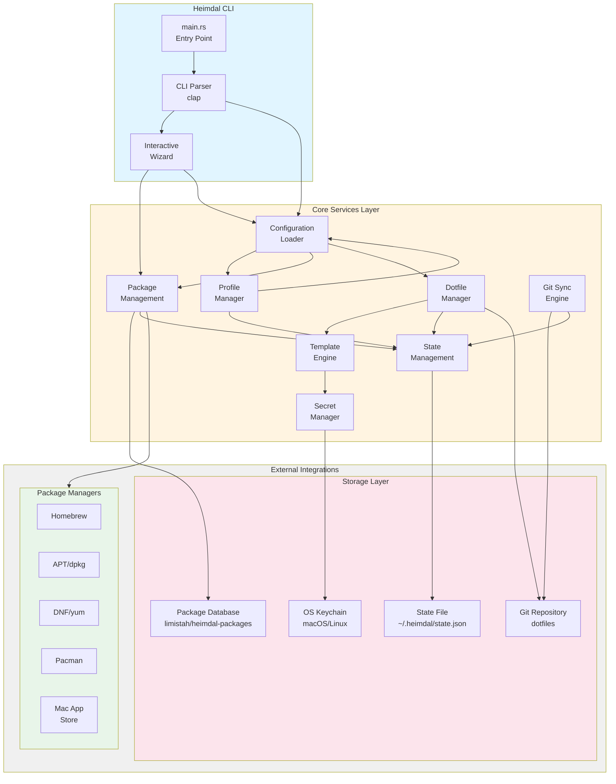
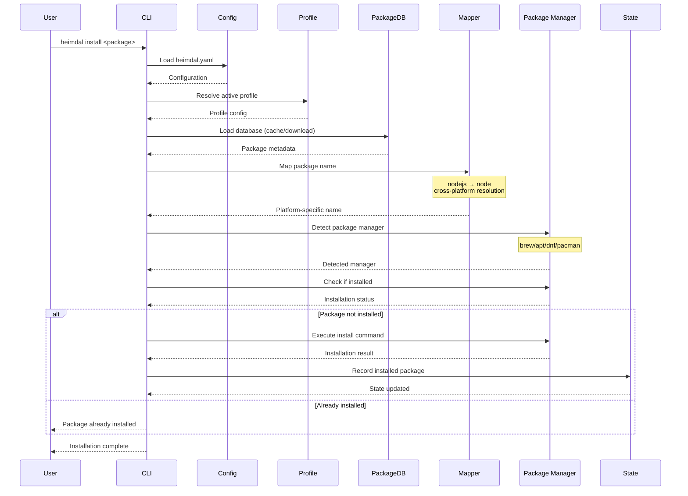
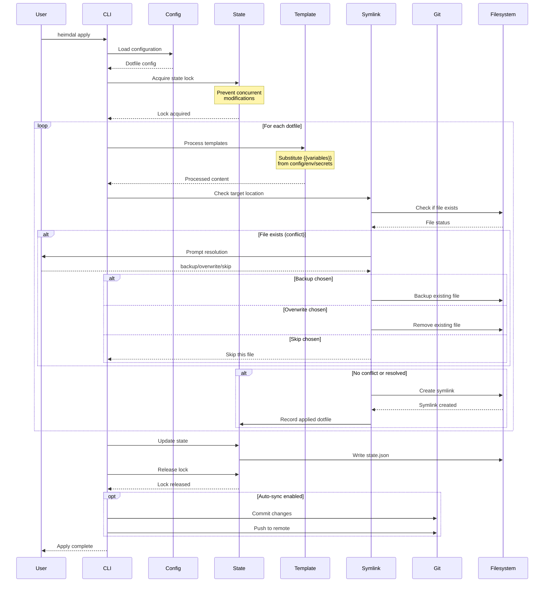
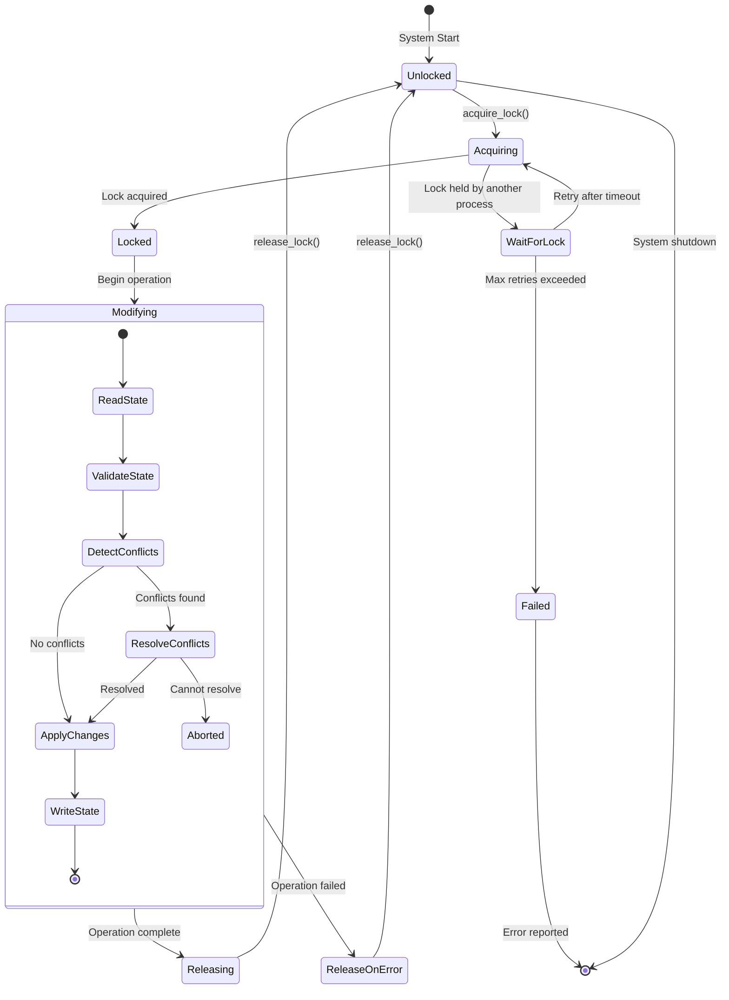
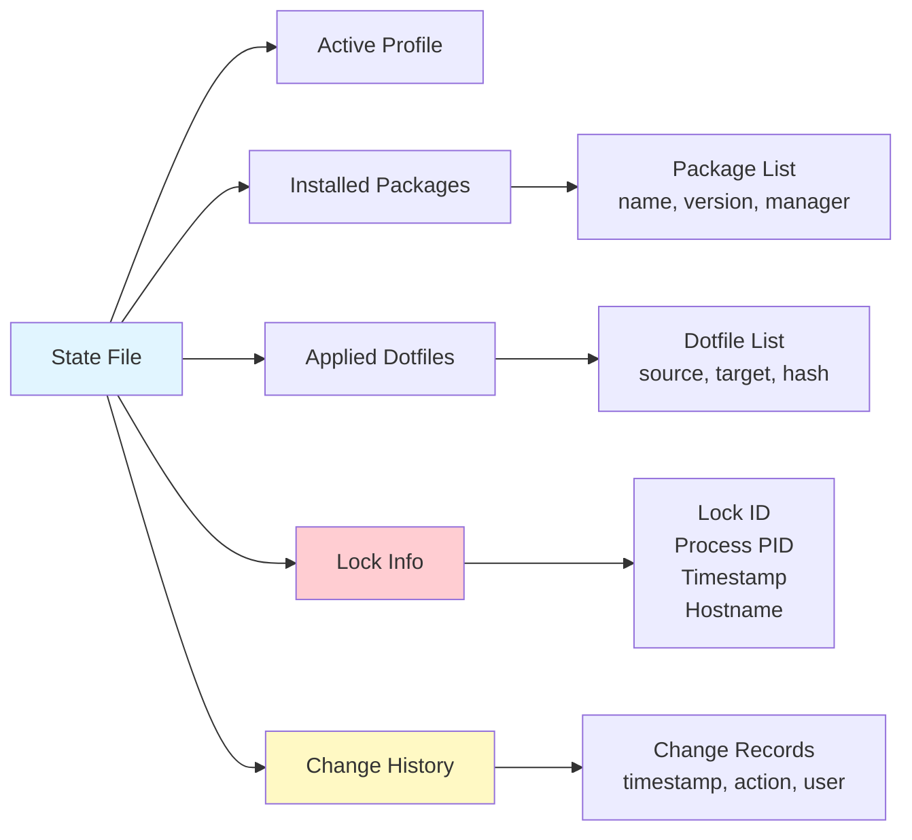
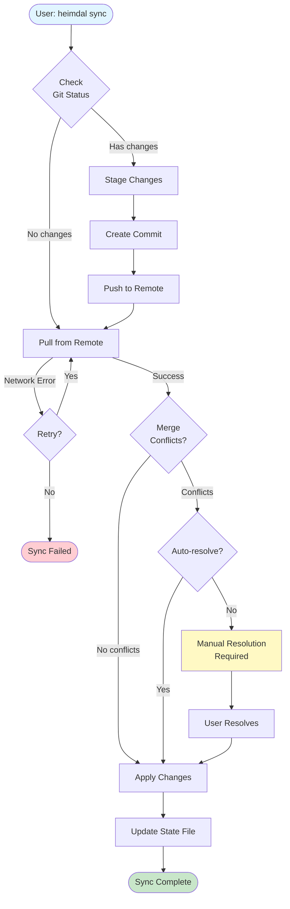
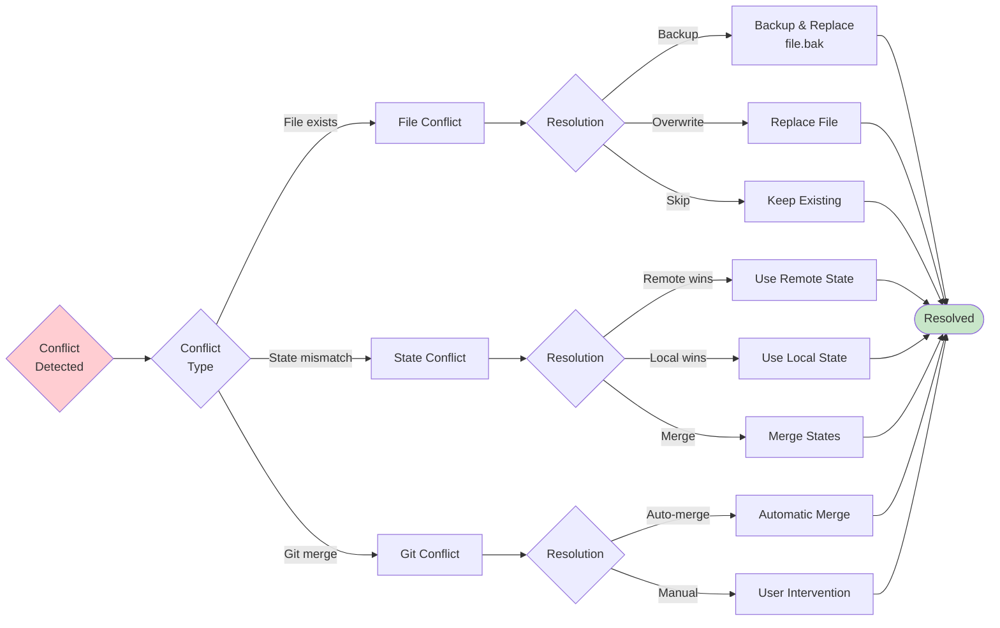
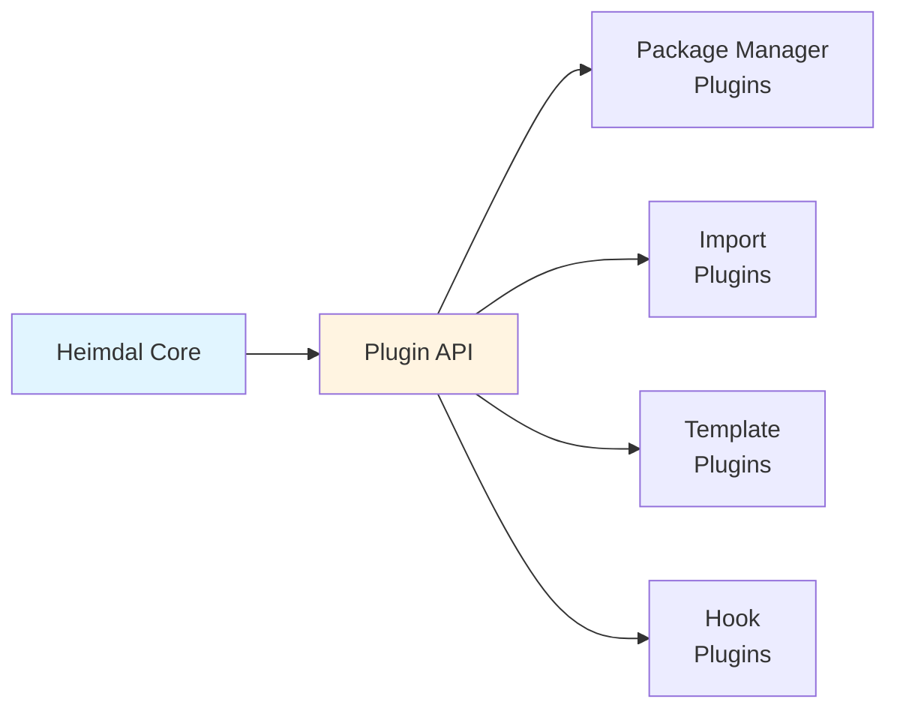

# Architecture Overview

> **Status:** This document is being developed as part of the documentation overhaul (Week 3).

This document provides a comprehensive overview of Heimdal's system architecture, design decisions, and component interactions.

## Table of Contents

1. [System Overview](#system-overview)
2. [Core Components](#core-components)
3. [Data Flow](#data-flow)
4. [Design Principles](#design-principles)
5. [Module Structure](#module-structure)

## System Overview

Heimdal is a universal dotfile and system configuration manager built in Rust. The architecture is designed around several key principles:

- **Cross-platform compatibility** - Works on macOS, Linux (Debian, Ubuntu, Fedora, Arch, Alpine)
- **Declarative configuration** - YAML-based configuration with profile support
- **State management** - Terraform-inspired state locking and conflict resolution
- **Package abstraction** - Universal interface across multiple package managers
- **Git-centric** - Built around Git workflows for syncing configurations

## Core Components

### System Architecture Diagram



## Data Flow

### Package Installation Flow



### Dotfile Sync Flow



## Design Principles

### 1. **State Management**
Inspired by Terraform, Heimdal maintains a state file (`~/.heimdal/heimdal.state.json`) that tracks:
- Active profile
- Installed packages
- Applied dotfiles
- Last sync timestamp
- Conflict history

See [State Management Documentation](STATE_MANAGEMENT.md) for details.

#### State Management Lifecycle



#### State File Structure



### 2. **Package Database**
A separate repository ([heimdal-packages](https://github.com/limistah/heimdal-packages)) maintains package metadata:
- YAML source definitions
- Compiled binary format (Bincode)
- Distributed via GitHub Releases
- Auto-updated every 7 days

See [Package Database Documentation](PACKAGE_DATABASE.md) for details.

### 3. **Profile-Based Configuration**
Users can define multiple profiles (work, personal, server) with:
- Different package sets
- Different dotfile targets
- Different template variables
- Profile inheritance support

### 4. **Cross-Platform Compatibility**
- Package name mapping (e.g., `nodejs` → `node`)
- Platform detection at runtime
- Conditional configuration based on OS/platform
- Graceful degradation when features unavailable

### Git Sync Workflow

Heimdal integrates Git deeply for versioning and syncing dotfiles across machines.



### Conflict Resolution Strategies



## Module Structure

```
src/
├── main.rs              # CLI entry point
├── commands/            # CLI command handlers
│   ├── packages/        # Package management commands
│   └── state/           # State management commands
├── config/              # Configuration loading and validation
├── git/                 # Git operations
├── hooks/               # Hook system (pre/post scripts)
├── import/              # Import from other dotfile managers
├── package/             # Package management
│   ├── database/        # Package database handling
│   └── profiles/        # Package profiles
├── profile/             # Profile management
├── secrets/             # Secret management (keychain)
├── state/               # State management (locking, conflicts)
├── symlink/             # Symlink creation (GNU Stow)
├── sync/                # Git sync operations
├── templates/           # Template engine
├── utils/               # Shared utilities
└── wizard/              # Interactive setup wizard
```

See [Module Guide](MODULE_GUIDE.md) for detailed module documentation.

## Key Design Decisions

### Why Rust?
- **Performance** - Fast startup time, efficient resource usage
- **Reliability** - Memory safety, no runtime errors
- **Cross-platform** - Single binary for all platforms
- **Type safety** - Catch errors at compile time

### Why Binary Package Database?
- **Speed** - Bincode deserialization is ~100x faster than JSON
- **Size** - Binary format is more compact (~20KB vs ~80KB JSON)
- **Type safety** - Schema enforced at compile time
- **Offline-first** - Cached locally, auto-updates in background

### Why GNU Stow Compatibility?
- **Ecosystem** - Leverage existing Stow knowledge and tools
- **Simplicity** - Stow's directory structure is intuitive
- **Migration** - Easy migration path from Stow
- **Flexibility** - Users can use Stow and Heimdal interchangeably

### Why OS Keychain Integration?
- **Security** - Secrets never stored in Git
- **Native** - Uses platform-provided secure storage
- **Encrypted** - OS-level encryption
- **Accessible** - Easy to use from CLI and scripts

## Future Architecture Improvements

### Planned Enhancements

#### 1. Plugin System
Enable community-contributed extensions:
- Custom package managers
- Additional import formats
- Custom template functions
- Hook integrations



#### 2. Remote State Backend
Support for team collaboration:
- S3-backed state storage
- Shared team configurations
- Conflict resolution across team members
- Audit logging

#### 3. Parallel Operations
Improve performance for large installations:
- Concurrent package installations
- Parallel dotfile processing
- Background database updates

#### 4. Advanced Templating
Enhanced template capabilities:
- Conditional blocks
- Loops and iterations
- External data sources
- Computed values

#### 5. Drift Detection
Monitor configuration changes:
- Detect manual package installations
- Alert on dotfile modifications
- Auto-remediation options
- Compliance reporting

---

**Related Documentation:**
- [State Management](STATE_MANAGEMENT.md)
- [Package Database](PACKAGE_DATABASE.md)
- [Module Guide](MODULE_GUIDE.md)
- [Contributing Guide](dev/CONTRIBUTING.md)
