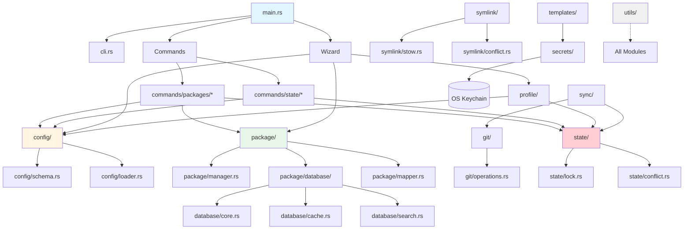
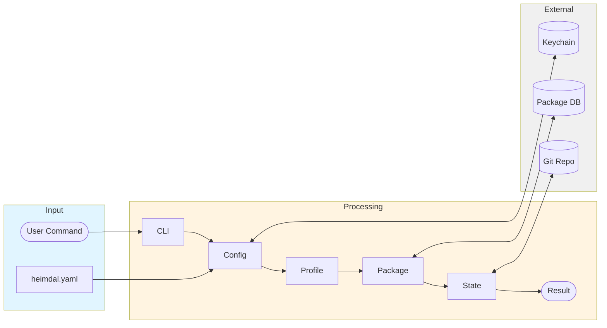

# Module Guide

> **Status:** This document is being developed as part of the documentation overhaul (Week 3).

This guide provides an overview of Heimdal's codebase structure and module organization to help contributors navigate and understand the project.

## Table of Contents

1. [Codebase Overview](#codebase-overview)
2. [Module Descriptions](#module-descriptions)
3. [Dependency Graph](#dependency-graph)
4. [Common Patterns](#common-patterns)
5. [Adding New Features](#adding-new-features)

## Codebase Overview

Heimdal consists of approximately **85 source files** organized into **14 major modules**, totaling around **24,000 lines of code**.

```
src/
├── main.rs              # CLI entry point (667 lines)
├── cli.rs               # CLI argument parsing (146 lines)
├── commands/            # Command implementations
│   ├── packages/        # Package management commands
│   └── state/           # State management commands
├── config/              # Configuration system
├── git/                 # Git operations
├── hooks/               # Hook system
├── import/              # Import from other dotfile managers
├── package/             # Package management
├── profile/             # Profile management
├── secrets/             # Secret management
├── state/               # State management
├── symlink/             # Symlink creation (GNU Stow)
├── sync/                # Git sync operations
├── templates/           # Template engine
├── utils/               # Shared utilities
└── wizard/              # Interactive setup wizard
```

## Module Descriptions

### `main.rs` - Entry Point
**Location:** `src/main.rs` (667 lines)

**Purpose:** Application entry point, CLI routing, and command dispatch.

**Key Functions:**
- `main()` - Entry point
- Command routing based on CLI arguments
- Global error handling
- Logging setup

**Dependencies:**
- All command modules
- `cli` module for argument parsing

### `cli.rs` - CLI Argument Parsing
**Location:** `src/cli.rs` (146 lines)

**Purpose:** Define CLI structure using `clap` crate.

**Key Structs:**
- `Cli` - Root CLI structure
- `Commands` - Enum of all subcommands
- Various subcommand structs

**Dependencies:**
- `clap` for argument parsing

### `commands/` - Command Implementations

#### `commands/packages/` - Package Commands
**Files:**
- `mod.rs` - Module exports
- `search.rs` - Package search
- `install.rs` - Package installation
- `info.rs` - Package information
- `outdated.rs` - Outdated package detection
- `upgrade.rs` - Package upgrades

**Purpose:** Implement all `heimdal packages *` commands.

**Key Functions:**
- `search_packages()` - Fuzzy search with scoring
- `install_package()` - Install single package
- `get_outdated_packages()` - Detect outdated packages
- `upgrade_packages()` - Upgrade packages

**Dependencies:**
- `package` module
- `config` module
- `state` module

#### `commands/state/` - State Commands
**Files:**
- `mod.rs` - Module exports
- `lock.rs` - State locking
- `unlock.rs` - State unlocking
- `conflict.rs` - Conflict resolution

**Purpose:** Implement all `heimdal state *` commands.

**Key Functions:**
- `lock_state()` - Acquire state lock
- `unlock_state()` - Release state lock
- `resolve_conflicts()` - Resolve state conflicts

**Dependencies:**
- `state` module
- `config` module

### `config/` - Configuration System
**Files:**
- `mod.rs` - Module exports and main loader
- `schema.rs` - Configuration structs
- `loader.rs` - YAML loading and parsing
- `profile.rs` - Profile resolution
- `conditions.rs` - Conditional configuration

**Purpose:** Load, validate, and manage `heimdal.yaml` configuration.

**Key Structs:**
- `Config` - Root configuration
- `Profile` - Profile configuration
- `PackageSource` - Package sources
- `DotfilesConfig` - Dotfile configuration

**Key Functions:**
- `load_config()` - Load config from file
- `validate_config()` - Validate configuration
- `resolve_profile()` - Resolve active profile

**Dependencies:**
- `serde_yaml` for YAML parsing
- `anyhow` for error handling

### `git/` - Git Operations
**Files:**
- `mod.rs` - Module exports
- `operations.rs` - Git command wrappers
- `sync.rs` - Sync operations
- `remote.rs` - Remote management

**Purpose:** Wrap Git operations for dotfile syncing.

**Key Functions:**
- `git_commit()` - Commit changes
- `git_push()` - Push to remote
- `git_pull()` - Pull from remote
- `git_status()` - Check status

**Dependencies:**
- `git2` crate for Git operations
- Or `std::process::Command` for git CLI

### `hooks/` - Hook System
**Files:**
- `mod.rs` - Hook execution
- `runner.rs` - Script runner

**Purpose:** Execute user-defined hooks (pre/post scripts).

**Key Functions:**
- `run_hook()` - Execute a hook script
- `find_hooks()` - Discover hook scripts

**Dependencies:**
- `std::process::Command` for script execution

### `import/` - Import System
**Files:**
- `mod.rs` - Module exports and detection
- `stow.rs` - GNU Stow import
- `dotbot.rs` - dotbot import
- `chezmoi.rs` - chezmoi import
- `yadm.rs` - yadm import
- `homesick.rs` - homesick import

**Purpose:** Import configurations from other dotfile managers.

**Key Functions:**
- `detect_dotfile_manager()` - Auto-detect which manager
- `import_from_stow()` - Convert Stow setup
- `import_from_dotbot()` - Parse `install.conf.yaml`

**Dependencies:**
- `config` module
- `serde_yaml` for parsing configs

### `package/` - Package Management (Largest Module)
**Files:**
- `mod.rs` - Module exports
- `manager.rs` - Package manager abstraction
- `mapper.rs` - Cross-platform name mapping
- `installer.rs` - Package installation
- `database/` - Package database subsystem
  - `core.rs` - Database interface
  - `loader.rs` - Download and load database
  - `cache.rs` - Local caching
  - `search.rs` - Search functionality
- `profiles/` - Package profiles

**Purpose:** Universal package management across all platforms.

**Key Structs:**
- `PackageManager` - Abstraction over brew/apt/dnf/pacman
- `PackageDatabase` - In-memory database
- `Package` - Package metadata

**Key Functions:**
- `detect_package_manager()` - Detect platform package manager
- `install_package()` - Install via appropriate manager
- `search_database()` - Search package database
- `map_package_name()` - Map canonical name to platform name

**Dependencies:**
- `std::process::Command` for running package managers
- `bincode` for database deserialization
- `fuzzy-matcher` for search

### `profile/` - Profile Management
**Files:**
- `mod.rs` - Module exports
- `manager.rs` - Profile operations
- `inheritance.rs` - Profile inheritance

**Purpose:** Manage multiple profiles (work, personal, server).

**Key Functions:**
- `switch_profile()` - Change active profile
- `list_profiles()` - List available profiles
- `resolve_inheritance()` - Handle profile inheritance

**Dependencies:**
- `config` module
- `state` module

### `secrets/` - Secret Management
**Files:**
- `mod.rs` - Module exports
- `store.rs` - Keychain integration

**Purpose:** Secure secret storage using OS keychains.

**Key Functions:**
- `store_secret()` - Save secret to keychain
- `retrieve_secret()` - Get secret from keychain
- `delete_secret()` - Remove secret

**Dependencies:**
- `keyring` crate for OS keychain access

### `state/` - State Management
**Files:**
- `mod.rs` - Module exports and core logic
- `lock.rs` - State locking (Terraform-inspired)
- `conflict.rs` - Conflict detection and resolution
- `history.rs` - State history

**Purpose:** Track Heimdal state, prevent conflicts, handle locking.

**Key Structs:**
- `State` - Current state (active profile, packages, etc.)
- `StateLock` - Lock information
- `ConflictInfo` - Conflict details

**Key Functions:**
- `acquire_lock()` - Acquire state lock
- `release_lock()` - Release state lock
- `detect_conflicts()` - Find conflicting changes
- `save_state()` - Persist state to disk

**Dependencies:**
- `serde_json` for state serialization

**See Also:** [State Management Documentation](STATE_MANAGEMENT.md)

### `symlink/` - Symlink Management
**Files:**
- `mod.rs` - Module exports
- `linker.rs` - Symlink creation
- `stow.rs` - GNU Stow compatibility
- `conflict.rs` - Conflict detection

**Purpose:** Create and manage symlinks (GNU Stow compatible).

**Key Functions:**
- `create_symlinks()` - Create symlinks for dotfiles
- `detect_conflicts()` - Find existing files
- `resolve_conflicts()` - Backup/overwrite/skip
- `stow_directory()` - Stow-style directory handling

**Dependencies:**
- `std::fs` for filesystem operations

### `sync/` - Git Sync Operations
**Files:**
- `mod.rs` - Module exports
- `manager.rs` - Sync manager

**Purpose:** High-level Git sync operations.

**Key Functions:**
- `sync_pull()` - Pull changes from remote
- `sync_push()` - Push changes to remote
- `auto_sync()` - Automatic background sync

**Dependencies:**
- `git` module
- `state` module

### `templates/` - Template Engine
**Files:**
- `mod.rs` - Module exports
- `engine.rs` - Template processing
- `variables.rs` - Variable resolution

**Purpose:** Process templates with variable substitution.

**Key Functions:**
- `render_template()` - Process template file
- `substitute_variables()` - Replace {{variable}} placeholders
- `resolve_variable()` - Get variable value from config/env

**Dependencies:**
- `regex` for pattern matching

### `utils/` - Shared Utilities
**Files:**
- `mod.rs` - Module exports
- `logger.rs` - Logging helpers
- `error.rs` - Error types
- `os.rs` - OS detection
- `path.rs` - Path utilities

**Purpose:** Shared utility functions across modules.

**Key Functions:**
- `detect_os()` - Detect current OS
- `expand_tilde()` - Expand `~` in paths
- `setup_logger()` - Initialize logging
- Error types and helpers

**Dependencies:**
- `log` crate for logging
- `anyhow` for error handling

### `wizard/` - Interactive Setup Wizard
**Files:**
- `mod.rs` - Module exports and orchestration
- `scanner.rs` - Dotfile scanning
- `prompts.rs` - Interactive prompts
- `generator.rs` - Config generation
- `package_detector.rs` - Detect installed packages

**Purpose:** Interactive setup wizard for first-time users.

**Key Functions:**
- `run_wizard()` - Main wizard flow
- `scan_dotfiles()` - Scan home directory
- `detect_packages()` - Detect installed packages
- `generate_config()` - Generate `heimdal.yaml`

**Dependencies:**
- `dialoguer` for interactive prompts
- `indicatif` for progress bars
- `config` module
- `package` module

## Dependency Graph

### Module Dependencies



### Data Flow Between Modules



## Common Patterns

### Error Handling
All modules use `anyhow::Result<T>` for error handling:

```rust
use anyhow::{Context, Result};

pub fn load_config(path: &Path) -> Result<Config> {
    let content = fs::read_to_string(path)
        .context("Failed to read config file")?;
    
    let config: Config = serde_yaml::from_str(&content)
        .context("Failed to parse YAML")?;
    
    Ok(config)
}
```

**Real Example from `src/config/loader.rs`:**
```rust
pub fn load_config(config_path: Option<&Path>) -> Result<Config> {
    let path = config_path
        .map(|p| p.to_path_buf())
        .unwrap_or_else(|| {
            dirs::home_dir()
                .expect("Could not find home directory")
                .join(".heimdal")
                .join("heimdal.yaml")
        });

    if !path.exists() {
        anyhow::bail!("Config file not found at {:?}", path);
    }

    let content = fs::read_to_string(&path)
        .context(format!("Failed to read config file: {:?}", path))?;
    
    let config: Config = serde_yaml::from_str(&content)
        .context("Failed to parse YAML configuration")?;
    
    validate_config(&config)?;
    Ok(config)
}
```

### Logging
Use the `log` crate macros:

```rust
use log::{info, warn, error, debug};

info!("Loading configuration from {:?}", path);
warn!("Package not found in database: {}", name);
error!("Failed to create symlink: {}", err);
debug!("Resolved package name: {} -> {}", canonical, platform);
```

**Real Example from `src/package/database/loader.rs`:**
```rust
pub async fn load_database() -> Result<PackageDatabase> {
    debug!("Loading package database...");
    
    let cache_path = get_cache_path()?;
    
    if cache_path.exists() && !is_cache_stale(&cache_path)? {
        info!("Loading package database from cache: {:?}", cache_path);
        return load_from_cache(&cache_path);
    }
    
    info!("Cache stale or missing, downloading fresh database...");
    download_and_cache_database().await
}
```

### Package Manager Trait Pattern
All package managers implement a common trait:

**Real Example from `src/package/manager.rs`:**
```rust
/// Common interface for all package managers
pub trait PackageManager: Send + Sync {
    /// Name of the package manager
    fn name(&self) -> &str;

    /// Check if this package manager is available on the system
    fn is_available(&self) -> bool;

    /// Check if a package is installed
    fn is_installed(&self, package: &str) -> bool;

    /// Install a package
    fn install(&self, package: &str, dry_run: bool) -> Result<()>;

    /// Install multiple packages at once (more efficient)
    fn install_many(&self, packages: &[String], dry_run: bool) 
        -> Result<Vec<InstallResult>>;

    /// Update package manager's package list
    fn update(&self, dry_run: bool) -> Result<()>;
}

// Example implementation for Homebrew
pub struct Homebrew;

impl PackageManager for Homebrew {
    fn name(&self) -> &str {
        "homebrew"
    }

    fn is_available(&self) -> bool {
        Command::new("brew")
            .arg("--version")
            .output()
            .map(|output| output.status.success())
            .unwrap_or(false)
    }

    fn is_installed(&self, package: &str) -> bool {
        Command::new("brew")
            .args(["list", package])
            .output()
            .map(|output| output.status.success())
            .unwrap_or(false)
    }

    fn install(&self, package: &str, dry_run: bool) -> Result<()> {
        if dry_run {
            info!("DRY RUN: Would install package: {}", package);
            return Ok(());
        }

        let status = Command::new("brew")
            .args(["install", package])
            .status()
            .context("Failed to execute brew install")?;

        if !status.success() {
            anyhow::bail!("Failed to install package: {}", package);
        }

        Ok(())
    }

    // ... other methods
}
```

### Configuration Struct Pattern

**Real Example from `src/config/schema.rs`:**
```rust
use serde::{Deserialize, Serialize};
use std::collections::HashMap;

#[derive(Debug, Clone, Serialize, Deserialize)]
pub struct Config {
    /// Active profile name
    pub profile: Option<String>,
    
    /// All defined profiles
    pub profiles: HashMap<String, Profile>,
    
    /// Dotfiles configuration
    pub dotfiles: Option<DotfilesConfig>,
    
    /// Git sync configuration
    pub sync: Option<SyncConfig>,
    
    /// Global settings
    pub settings: Option<Settings>,
}

#[derive(Debug, Clone, Serialize, Deserialize)]
pub struct Profile {
    /// Profile display name
    pub name: String,
    
    /// Inherit from another profile
    pub inherits: Option<String>,
    
    /// Packages to install
    pub packages: Vec<String>,
    
    /// Template variables
    pub variables: Option<HashMap<String, String>>,
    
    /// Platform-specific overrides
    pub platforms: Option<HashMap<String, PlatformConfig>>,
}
```

### State Management Pattern

**Real Example from `src/state/mod.rs`:**
```rust
#[derive(Debug, Clone, Serialize, Deserialize)]
pub struct State {
    /// Active profile name
    pub active_profile: String,
    
    /// Installed packages with metadata
    pub installed_packages: Vec<InstalledPackage>,
    
    /// Applied dotfiles with checksums
    pub applied_dotfiles: Vec<AppliedDotfile>,
    
    /// Last sync timestamp
    pub last_sync: Option<DateTime<Utc>>,
    
    /// State lock information
    pub lock: Option<StateLock>,
}

impl State {
    /// Load state from disk
    pub fn load() -> Result<Self> {
        let state_path = Self::state_path()?;
        
        if !state_path.exists() {
            return Ok(Self::default());
        }
        
        let content = fs::read_to_string(&state_path)
            .context("Failed to read state file")?;
        
        let state: State = serde_json::from_str(&content)
            .context("Failed to parse state JSON")?;
        
        Ok(state)
    }
    
    /// Save state to disk
    pub fn save(&self) -> Result<()> {
        let state_path = Self::state_path()?;
        let state_dir = state_path.parent()
            .context("Invalid state path")?;
        
        fs::create_dir_all(state_dir)
            .context("Failed to create state directory")?;
        
        let content = serde_json::to_string_pretty(self)
            .context("Failed to serialize state")?;
        
        fs::write(&state_path, content)
            .context("Failed to write state file")?;
        
        Ok(())
    }
}
```

### Testing
Tests are colocated with source files using `#[cfg(test)]`:

```rust
#[cfg(test)]
mod tests {
    use super::*;

    #[test]
    fn test_package_search() {
        let db = PackageDatabase::new();
        let results = db.search("nodejs");
        assert!(!results.is_empty());
    }
    
    #[test]
    fn test_config_validation() {
        let config = Config {
            profile: Some("work".to_string()),
            profiles: HashMap::new(),
            dotfiles: None,
            sync: None,
            settings: None,
        };
        
        let result = validate_config(&config);
        assert!(result.is_err()); // Missing required profile
    }
}
```

**Real Example from `src/package/mapper.rs`:**
```rust
#[cfg(test)]
mod tests {
    use super::*;

    #[test]
    fn test_common_package_mappings() {
        let mapper = PackageMapper::new();
        
        // Test Node.js mapping
        assert_eq!(
            mapper.map_package_name("nodejs", Platform::MacOS),
            "node"
        );
        
        // Test Python mapping
        assert_eq!(
            mapper.map_package_name("python3", Platform::Ubuntu),
            "python3"
        );
        
        // Test package manager specific names
        assert_eq!(
            mapper.map_package_name("httpie", Platform::MacOS),
            "httpie"
        );
    }
    
    #[test]
    fn test_platform_detection() {
        let platform = detect_platform();
        assert!(platform.is_ok());
    }
}
```

## Adding New Features

### Quick Navigation for Common Tasks

| Want to... | Start here | Key files |
|------------|------------|-----------|
| Add a new CLI command | `src/cli.rs` | `src/commands/`, `src/main.rs` |
| Support new package manager | `src/package/manager.rs` | `src/package/mapper.rs` |
| Modify configuration schema | `src/config/schema.rs` | `src/config/loader.rs` |
| Change state management | `src/state/mod.rs` | `src/state/lock.rs` |
| Add template features | `src/templates/engine.rs` | `src/templates/variables.rs` |
| Implement new import format | `src/import/` | Create new file in `import/` |
| Modify symlink behavior | `src/symlink/linker.rs` | `src/symlink/stow.rs` |
| Change Git operations | `src/git/operations.rs` | `src/sync/manager.rs` |
| Add secret storage options | `src/secrets/store.rs` | Update to support new backends |
| Extend wizard functionality | `src/wizard/mod.rs` | `src/wizard/prompts.rs` |

### Adding a New Command

1. **Define CLI arguments** in `src/cli.rs`
2. **Create command handler** in `src/commands/<category>/<command>.rs`
3. **Add routing** in `src/main.rs`
4. **Write tests** in the same file
5. **Update documentation** in wiki

### Adding a New Package Manager

1. **Add platform detection** in `src/package/manager.rs`
2. **Implement install/uninstall** methods
3. **Add to package mapping** in `src/package/mapper.rs`
4. **Write integration tests**
5. **Update documentation**

### Adding a New Import Format

1. **Create importer** in `src/import/<format>.rs`
2. **Add detection logic** in `src/import/mod.rs`
3. **Implement conversion** to Heimdal format
4. **Write tests** with sample configs
5. **Update wizard** to include new format

---

**Related Documentation:**
- [Architecture Overview](ARCHITECTURE.md)
- [Contributing Guide](dev/CONTRIBUTING.md)
- [Testing Guide](dev/TESTING.md)

**Getting Started:**
- Read through `src/main.rs` to understand the entry point
- Explore `src/config/` to see how configuration works
- Check `src/package/database/` for package database internals
- Look at `src/wizard/` for interactive CLI patterns
